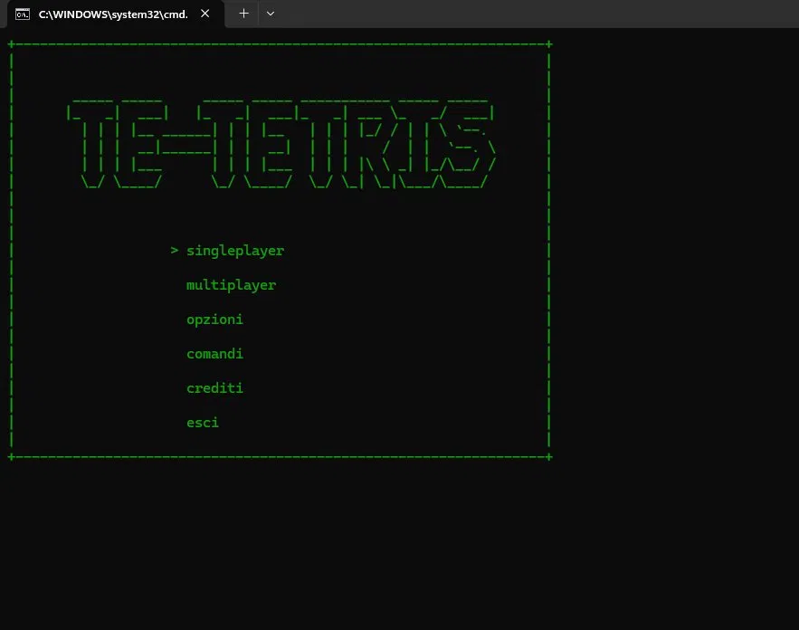
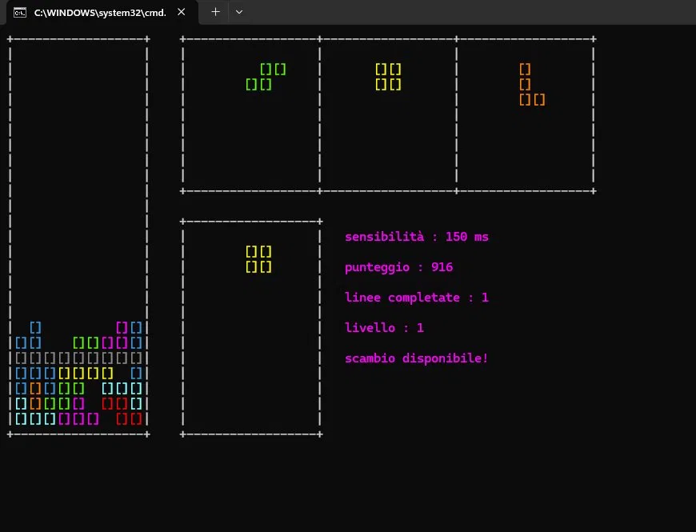
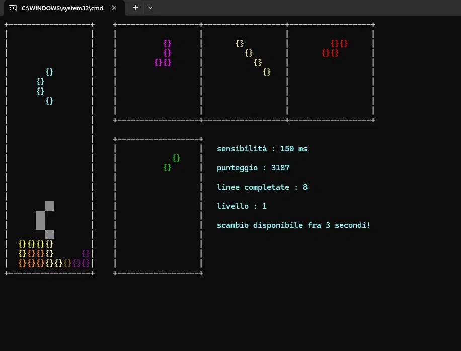
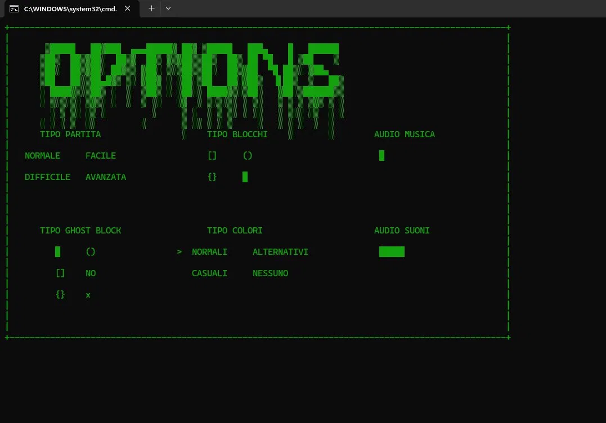
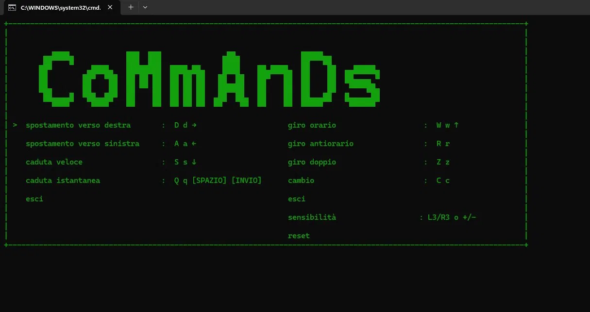

# 🎮 te-tetris

> Un Tetris costruito da zero in C++, direttamente nel terminale — reinventato, personalizzabile e più difficile che mai.



---

## 📋 Indice

- [Cos'è te-tetris](#-cosè-te-tetris)
- [Gameplay e modalità](#-gameplay-e-modalità)
- [Personalizzazione](#-personalizzazione)
- [Controlli](#-controlli)
- [Requisiti e Build](#-requisiti-e-build)
- [Struttura del progetto](#-struttura-del-progetto)
- [Dipendenze](#-dipendenze)
- [Roadmap](#-roadmap)

---

## 🕹️ Cos'è te-tetris

**te-tetris** nasce da una sfida semplice: ricostruire il Tetris da zero in C++, senza copiare nessuna implementazione esistente, cercando di reinventarlo pezzo per pezzo. Tutto quello che vedi — l'interfaccia, i tetramini, le animazioni ASCII, la logica di gioco — è stato progettato e scritto a mano.

Il gioco gira interamente nel **terminale**, con una grafica ASCII colorata che rende l'esperienza sorprendentemente fluida. L'audio è gestito da **SFML** in background, mentre tutto il resto è puro C++17.

---

## 🎮 Gameplay e modalità



Il gameplay segue le regole classiche del Tetris, con alcune aggiunte originali:

- **Punteggio, livello e linee** mostrati in tempo reale
- **Sistema di scambio** (hold piece) con cooldown: puoi tenere da parte un pezzo e usarlo al momento giusto
- **Ghost block** che mostra dove atterrerà il pezzo
- **Sensibilità regolabile** al volo durante la partita



### Modalità di gioco

Il gioco offre quattro modalità selezionabili dalle opzioni:

- **Normale** — il Tetris classico con i 7 tetramini originali
- **Facile** — ritmo più lento, per chi si avvicina al gioco
- **Difficile** — più veloce, meno margine di errore
- **Avanzata** — la modalità più originale: oltre ai 7 tetramini classici, ne arrivano altri **7 inediti** progettati da zero, con forme asimmetriche e rotazioni inusuali che stravolgono completamente il gameplay

---

## ⚙️ Personalizzazione

Una delle caratteristiche centrali di te-tetris è quanta libertà dà al giocatore. Quasi tutto è configurabile.



Dalle opzioni di gioco puoi cambiare:

- **Tipo di blocchi** — scegli tra `[]`, `()`, `{}` o un blocco pieno: ogni stile cambia completamente l'aspetto del campo
- **Ghost block** — stesso principio: `[]`, `()`, `{}`, pieno, o nessuno
- **Tipo di colori** — normali, alternativi, casuali o nessun colore
- **Audio musica** e **audio suoni** — volumi separati e regolabili
- **Modalità di gioco** — normale, facile, difficile, avanzata

Oltre all'interfaccia grafica, puoi configurare il gioco anche tramite un **file `config.json`**, dove salvare le tue preferenze e i tuoi comandi personalizzati.

---

## 🎹 Controlli



| Azione | Tasti |
|--------|-------|
| Muovi a destra | `D` `d` `→` |
| Muovi a sinistra | `A` `a` `←` |
| Caduta veloce | `S` `s` `↓` |
| Caduta istantanea | `Q` `q` `Spazio` `Invio` |
| Giro orario | `W` `w` `↑` |
| Giro antiorario | `R` `r` |
| Giro doppio (180°) | `Z` `z` |
| Scambio (hold) | `C` `c` |
| Sensibilità | `+` `-` |
| Esci | `Esc` |

> I controlli sono completamente personalizzabili dal file `config.json`.

---

## 🚀 Requisiti e Build

**Requisiti:**

| Strumento | Versione minima |
|-----------|----------------|
| Compilatore C++ | GCC 10+ / Clang 12+ / MSVC 2019+ |
| CMake | 3.20+ |
| Git | qualsiasi versione recente |

Le dipendenze vengono scaricate automaticamente da CMake alla prima build — non devi installare nulla a mano.

**Linux** — installa prima i pacchetti di sistema per SFML audio:
```bash
sudo apt install libopenal-dev libvorbis-dev libflac-dev
```

### Build e avvio

```bash
# 1. Clona la repo
git clone https://github.com/Adrotto2008/te-tetris.git
cd te-tetris

# 2. Configura CMake (scarica le dipendenze, ci vuole qualche minuto la prima volta)
cmake -B cmake-build-debug -S .

# 3. Compila e avvia
./compila.sh        # Linux/macOS
compila.bat         # Windows
```

Se vuoi solo compilare senza avviare:
```bash
./build.sh          # Linux/macOS
build.bat           # Windows
```

L'eseguibile viene generato nella cartella `bin/`.

---

## 📁 Struttura del progetto

```
te-tetris/
├── versions/
│   └── current/          # Sorgenti attivi
│       ├── main.cpp
│       ├── src/          # Implementazioni
│       └── include/      # Header
├── bin/                  # Eseguibili e script di avvio
├── sounds/               # File audio (SFML)
├── images/               # Screenshot per il README
├── CMakeLists.txt        # Build principale
├── compila.sh / .bat     # Compila + avvia
└── build.sh / .bat       # Solo compila
```

---

## 📦 Dipendenze

| Libreria | Versione | Uso |
|----------|----------|-----|
| [SFML](https://github.com/SFML/SFML) | 2.6.1 | Solo audio |
| [nlohmann/json](https://github.com/nlohmann/json) | 3.11.3 | Parsing `config.json` |
| [cpp-httplib](https://github.com/yhirose/cpp-httplib) | 0.15.3 | HTTP (funzionalità future) |
| [IXWebSocket](https://github.com/machinezone/IXWebSocket) | 11.4.5 | WebSocket (funzionalità future) |
| [zlib](https://github.com/madler/zlib) | 1.3.1 | Compressione |

---

## 🗺️ Roadmap

- [x] Gameplay Tetris classico
- [x] Modalità avanzata con 7 tetramini inediti
- [x] Personalizzazione blocchi, colori e ghost block
- [x] Effetti sonori e musica (SFML Audio)
- [x] Salvataggio preferenze via `config.json`
- [x] Sistema di scambio con cooldown
- [ ] Leaderboard online
- [ ] Multiplayer in tempo reale

---

*Fatto con 💙 da zero in C++ — perché siamo fortissimi.*
